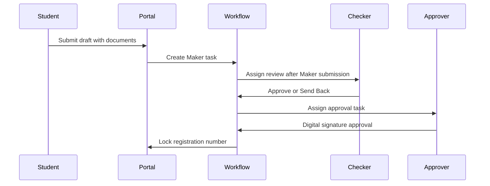
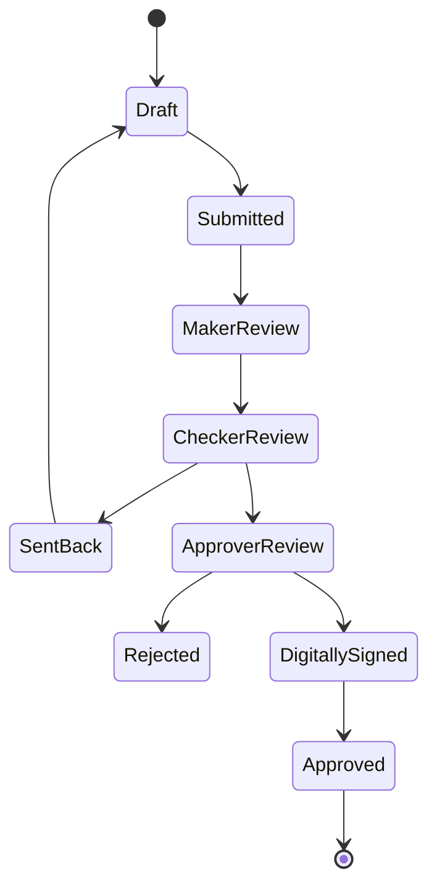

# Student and Admin Module Design

## Module 1: Student Module

### 1. Screen-Wise UI Design
- Dashboard: completion score, profile/document/education/contact cards, Maker-Checker-Approver timeline, SLA and workflow readiness.
- Basic Details: guided single-entry form grouped by identity, parent, address, photo, college/course mapping, admission year, and student status.
- Bulk Upload: downloadable Excel/CSV template, upload preview, validation summary, duplicate report, and import confirmation.
- Documents: document checklist mapped to identity, DOB, student ID, address, photo, and education certificates.
- Education Details: dynamic rows for X, XII, Diploma, Degree, PG, marks, grades, board/university, registration number, year of passing, and mandatory PDF proof.
- Verification: Maker, Checker, Approver actions with comments, reject, send back, approve, bulk approval, digital signature, workflow history, and SLA tracking.
- Registration Number: generated preview, prefix/year/course logic, approval lock state, and immutable final number.

### 2. Field-Level Validations
- Student name: required, 2-120 characters, letters/spaces only with local punctuation allowed.
- DOB: required, cannot be future date, age rule configurable by course.
- Gender: required enum.
- Aadhaar/Identity: required, format depends on selected identity type, encrypted at rest.
- Email: required, valid email, unique, OTP verified before final submit.
- Mobile: required, 10 digits for India, unique, OTP verified before final submit.
- Parent details: father/mother/guardian name required.
- Address: required, pin code 6 digits, state and district required.
- Student photo: JPG/PNG, max size configurable, face crop recommended.
- College/course/admission year: required, must match active mappings.
- Education: year cannot be future, marks obtained cannot exceed total marks, PDF proof mandatory per row.
- Documents: only PDF/JPG/PNG for identity documents, PDF required for education proof.
- Duplicate detection: email, mobile, Aadhaar/identity, student ID, and candidate name+DOB fuzzy match.

### 3. API Contracts
```http
POST /api/students/drafts
PUT /api/students/{studentId}/basic-details
POST /api/students/bulk-upload
GET /api/students/template
POST /api/students/{studentId}/documents
POST /api/students/{studentId}/education
POST /api/students/{studentId}/submit
POST /api/workflows/{workflowId}/actions
POST /api/students/{studentId}/registration-number/generate
GET /api/students/{studentId}/audit
```

Workflow action body:
```json
{
  "action": "APPROVE",
  "comment": "Verified against uploaded proof",
  "digitalSignatureId": "dsc-123",
  "nextAssigneeId": "user-456"
}
```

### 4. DB Schema With Relationships
```sql
students(id, board_id, college_id, course_id, admission_year, name, dob, gender, identity_type, identity_hash, email, mobile, status, registration_number, approved_at)
student_parents(id, student_id, relation, name, mobile, email)
student_addresses(id, student_id, line1, line2, city, district, state, pin_code)
student_documents(id, student_id, document_type, file_id, ocr_status, verification_status)
student_education(id, student_id, level, board_university, institution, year_of_passing, total_marks, marks_obtained, grade, registration_number, certificate_number, document_id)
workflow_instances(id, entity_type, entity_id, status, current_step, sla_due_at)
workflow_tasks(id, workflow_id, step, assignee_role, assignee_user_id, status, due_at)
workflow_comments(id, workflow_id, task_id, user_id, comment, created_at)
audit_logs(id, actor_id, action, entity_type, entity_id, before_json, after_json, ip_address, created_at)
```

### 5. Workflow Engine Design
- Entity-driven workflow instance per student registration.
- Configurable steps: Maker -> Checker -> Approver -> Digital Signature -> Approved.
- Each step has role constraints, SLA due date, allowed actions, comment requirement, and escalation rule.
- Send back creates a task for the previous step with reason.
- Reject closes workflow and unlocks draft correction if configured.
- Approve advances to next step; final approval locks registration number.

### 6. Notification Triggers
- Draft created.
- OTP generated and verified.
- Bulk upload completed with errors.
- Document uploaded, rejected, or re-upload requested.
- Student submitted to Maker queue.
- Checker sends back or approves.
- Approver approves/rejects.
- SLA warning and SLA breach.
- Registration number generated.

### 7. Role Permissions
- Student: create/update own draft, upload own documents, view own workflow status.
- Maker: create/edit assigned student records, submit to checker.
- Checker: review documents/education, send back, recommend approval.
- Approver: approve/reject, digitally sign, bulk approve.
- Board Admin: manage board-level mappings and queues.
- Auditor: read-only access to audit and workflow history.

### 8. Audit Logging Strategy
- Log every create/update/delete, upload, workflow action, permission change, login, OTP event, and digital signature action.
- Store before/after JSON for mutable entities.
- Use append-only audit tables with retention policy.
- Include actor, role, tenant, IP, device, request id, and timestamp.

### 9. Sequence Diagrams


### 10. State Machine Design


## Module 2: Admin Module

### 1. Admin Dashboard Design
- Command dashboard with user lifecycle, RBAC coverage, workflow hierarchy, security posture, pending approvals, SLA breaches, and recent audit activity.
- Left navigation: Dashboard, User Management, RBAC Matrix, Workflow Mapping, Feature Flags, Security, Audit Logs.
- Every table supports search, filters, status chips, row actions, and audit-aware changes.

### 2. User Management Workflows
- Create user -> assign office/board/college/department -> assign role -> send activation OTP.
- Activate/deactivate user with comment and audit event.
- Reset password using OTP and forced password rotation.
- Profile updates require permission and audit capture.
- Locked accounts require admin unlock and optional MFA reset.

### 3. RBAC Matrix
- Super Admin: all modules, configuration, users, audit.
- Board Admin: board-scoped users, workflow, reports, configuration.
- College Admin: college-scoped users and student records.
- Maker: create/edit assigned records.
- Checker: verify and send back.
- Approver: approve/reject/sign.
- Viewer: read-only reports.
- Auditor: read-only records plus audit exports.

### 4. Permission Engine Architecture
- Policy input: subject, action, resource, context.
- Subject: user, role, office, department, board/college.
- Resource: module, student, document, workflow task, feature flag, audit log.
- Context: tenant, row ownership, workflow state, SLA, MFA state, feature flag state.
- Decision: allow, deny, require step-up auth, or require approval.

### 5. API Design
```http
POST /api/admin/users
PATCH /api/admin/users/{userId}
POST /api/admin/users/{userId}/activate
POST /api/admin/users/{userId}/deactivate
POST /api/admin/users/{userId}/reset-password
GET /api/admin/roles
PUT /api/admin/roles/{roleId}/permissions
POST /api/admin/workflow-hierarchy
PUT /api/admin/feature-flags/{flagId}
GET /api/admin/audit-logs
POST /api/auth/otp/request
POST /api/auth/otp/verify
```

### 6. Database Schema
```sql
users(id, name, email, mobile, designation, office_id, board_id, college_id, department_id, status, mfa_enabled)
roles(id, code, name, category)
permissions(id, module, feature, action)
role_permissions(role_id, permission_id, constraints_json)
user_roles(user_id, role_id, scope_type, scope_id)
offices(id, name, parent_id, organization_type)
workflow_hierarchy(id, office_id, maker_role_id, checker_role_id, approver_role_id, backup_approver_id, escalation_json)
feature_flags(id, tenant_id, module, flag_key, enabled, rollout_json)
sessions(id, user_id, device_id, refresh_token_hash, expires_at, revoked_at)
otp_challenges(id, user_id, channel, purpose, otp_hash, expires_at, verified_at)
```

### 7. Authentication Architecture
- Password login plus OTP challenge for admin roles.
- MFA mandatory for Super Admin, Board Admin, Approver, and Auditor.
- Refresh token rotation with replay detection.
- Device fingerprint and session revocation support.
- Step-up authentication for approvals, RBAC changes, user deactivation, exports, and feature flag changes.

### 8. Audit Logging
- Immutable audit table for admin actions.
- Log actor role and scope at action time.
- Log permission decisions for denied sensitive actions.
- Export audit logs with signed checksum.

### 9. Session Management
- Idle timeout: 20 minutes.
- Absolute timeout: 8 hours.
- Token rotation on refresh.
- Re-authentication required for privileged actions.
- Force logout on role, MFA, or status change.

### 10. Security Architecture
- Encrypt sensitive identity fields.
- Hash OTP and refresh tokens.
- Enforce tenant and row-level filters in API layer.
- Validate files by MIME, extension, size, and malware scan.
- Rate-limit login, OTP, search, export, and bulk upload.
- Use signed URLs for document access.
- Maintain audit immutability and backup retention.
